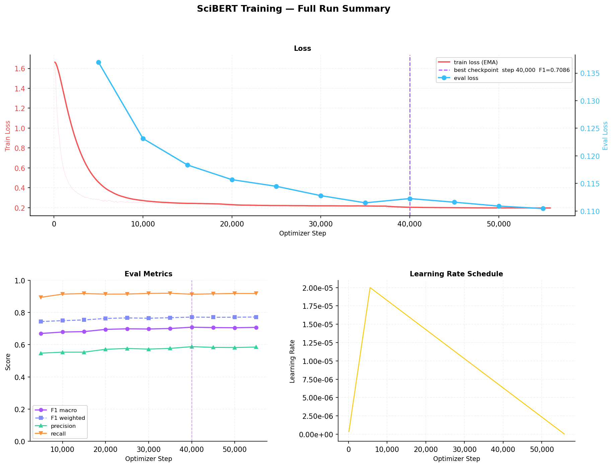
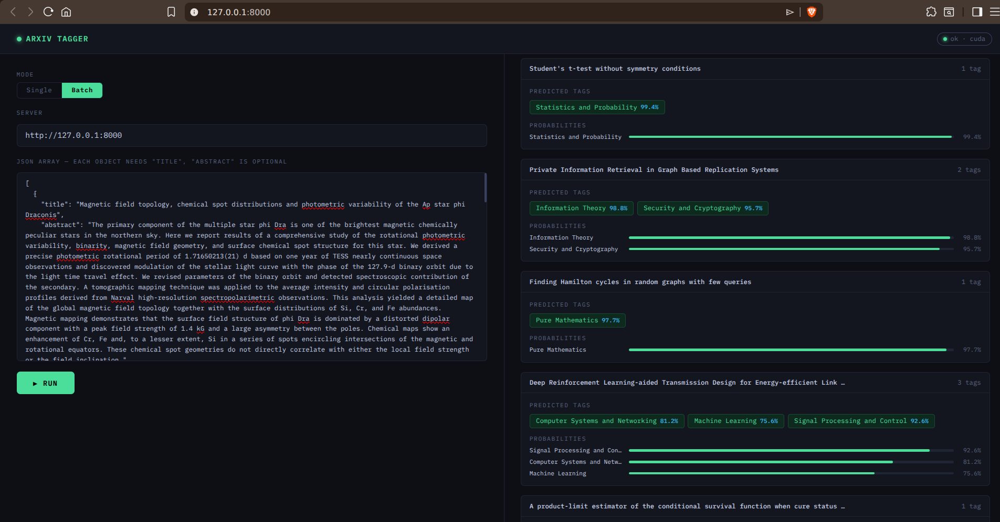

# arxiv-paper-discovery

Fine-tuned [SciBERT](https://huggingface.co/allenai/scibert_scivocab_uncased) for multi-label classification of arXiv papers, collapsing 170+ raw arXiv category codes into 25 curated domain labels. Trained on 2.3M+ papers across 3 epochs on dual T4 GPUs (Kaggle). Handles severe class imbalance via squared positive class weights and supports per-class threshold tuning post-training.

---

## Results

Evaluated on a held-out test set (~18.7K papers) using per-class thresholds tuned on the validation split.

| Metric      | Scalar threshold (0.35) | Per-class thresholds |
| ----------- | ----------------------- | -------------------- |
| Macro F1    | 0.7073                  | **0.7774**           |
| Weighted F1 | 0.7715                  | **0.8207**           |
| Precision   | —                       | 0.7666               |
| Recall      | —                       | 0.7897               |
| Hit Rate    | —                       | **0.9662**           |

Per-class thresholds give a **+7pp macro F1** improvement over a fixed scalar threshold.

<details>
<summary>Per-class breakdown</summary>

| Label                                 | Threshold | Precision | Recall | F1    |
| ------------------------------------- | --------- | --------- | ------ | ----- |
| Applied and Interdisciplinary Physics | 0.756     | 0.615     | 0.662  | 0.637 |
| Astrophysics                          | 0.763     | 0.948     | 0.938  | 0.943 |
| CS Theory and Algorithms              | 0.721     | 0.725     | 0.711  | 0.718 |
| Computer Systems and Networking       | 0.761     | 0.685     | 0.741  | 0.712 |
| Computer Vision                       | 0.794     | 0.882     | 0.885  | 0.884 |
| Condensed Matter Physics              | 0.719     | 0.904     | 0.893  | 0.898 |
| Gravitational Physics                 | 0.777     | 0.792     | 0.859  | 0.824 |
| High Energy Physics                   | 0.682     | 0.879     | 0.895  | 0.887 |
| Human Computer Interaction            | 0.785     | 0.735     | 0.728  | 0.732 |
| Information Theory                    | 0.855     | 0.751     | 0.758  | 0.755 |
| Machine Learning                      | 0.618     | 0.710     | 0.823  | 0.763 |
| Mathematical Physics                  | 0.747     | 0.529     | 0.575  | 0.551 |
| Natural Language Processing           | 0.795     | 0.805     | 0.854  | 0.829 |
| Nonlinear Dynamics                    | 0.806     | 0.584     | 0.635  | 0.608 |
| Nuclear Physics                       | 0.830     | 0.785     | 0.813  | 0.799 |
| Optimization and Numerical Methods    | 0.827     | 0.750     | 0.718  | 0.734 |
| Physics Other                         | 0.658     | 0.731     | 0.747  | 0.739 |
| Pure Mathematics                      | 0.658     | 0.935     | 0.912  | 0.924 |
| Quantitative Biology                  | 0.854     | 0.747     | 0.765  | 0.756 |
| Quantitative Finance and Economics    | 0.886     | 0.767     | 0.794  | 0.780 |
| Quantum Physics                       | 0.769     | 0.843     | 0.839  | 0.841 |
| Robotics                              | 0.854     | 0.816     | 0.845  | 0.830 |
| Security and Cryptography             | 0.876     | 0.782     | 0.823  | 0.802 |
| Signal Processing and Control         | 0.750     | 0.663     | 0.734  | 0.697 |
| Statistics and Probability            | 0.801     | 0.830     | 0.780  | 0.804 |

</details>



---

## Taxonomy

170+ arXiv category codes are mapped to 25 domain labels:

| Area                  | Labels                                                                                                                                                                                                                                        |
| --------------------- | --------------------------------------------------------------------------------------------------------------------------------------------------------------------------------------------------------------------------------------------- |
| **Computer Science**  | Machine Learning, Computer Vision, Natural Language Processing, Robotics, Security and Cryptography, Signal Processing and Control, Computer Systems and Networking, Information Theory, Human Computer Interaction, CS Theory and Algorithms |
| **Physics**           | High Energy Physics, Quantum Physics, Gravitational Physics, Nuclear Physics, Astrophysics, Condensed Matter Physics, Applied and Interdisciplinary Physics, Nonlinear Dynamics, Physics Other                                                |
| **Mathematics**       | Mathematical Physics, Statistics and Probability, Optimization and Numerical Methods, Pure Mathematics                                                                                                                                        |
| **Interdisciplinary** | Quantitative Biology, Quantitative Finance and Economics                                                                                                                                                                                      |

---

## Architecture and Training

- **Base model:** `allenai/scibert_scivocab_uncased` with a multi-label classification head
- **Training data:** ~2.3M arXiv papers (title + abstract), 13.5% sample used locally; full dataset on Kaggle
- **Class imbalance:** Squared positive class weights per label
- **Optimization:** AdamW, linear warmup, mixed-precision (fp16)
- **Threshold tuning:** Per-class thresholds optimized on the validation split via precision-recall curves

Key hyperparameters (see `configs/scibert.yaml`):

| Parameter             | Value   |
| --------------------- | ------- |
| Learning rate         | 2e-5    |
| Epochs                | 3       |
| Warmup ratio          | 0.1     |
| Weight decay          | 0.01    |
| Gradient accumulation | 4 steps |
| Default threshold     | 0.35    |

---

## Inference

Supports both offline batch inference and an online REST API.

**Batch** — accepts a HuggingFace dataset or a JSONL file (needs a `title` field; `abstract` is optional). Each output record is extended with `predicted_tags` and `tag_probabilities`.

**Online** — FastAPI + Ray Serve server with three endpoints:

| Endpoint              | Description                       |
| --------------------- | --------------------------------- |
| `POST /predict`       | Tag a single paper                |
| `POST /predict_batch` | Tag a list of papers              |
| `GET /health`         | Returns threshold and device info |
| `GET /`               | Interactive dashboard             |

### Dashboard




---

## Project Structure

```
configs/                                    # YAML experiment configs
data/
    raw/arxiv/                              # raw arXiv snapshot — READ ONLY
    processed/tok_scibert_scivocab_uncased/ # tokenized dataset ready for training
scripts/
    01_get_data.sh                          # download arXiv metadata from Kaggle
    02_create_base_dataset.py               # clean dataset
    03_build_taxonomy_dataset.py            # map categories to taxonomy labels
    04_tokenize_dataset.py                  # tokenize and save Arrow dataset
    run_training.py                         # single training run
    run_experiment.py                       # hyperparameter grid search
    run_eval.py                             # evaluate on test split
    tune_threshold.py                       # tune per-class thresholds on val split
    run_inference.py                        # offline batch inference
    run_serve.py                            # online inference server
src/arxiv_paper_discovery/
    label_taxonomy.py                       # arXiv category → taxonomy mapping
    train.py                                # Trainer pipeline and metrics
    predictor.py                            # ArticleTagger inference engine
    web/dashboard.html                      # inference dashboard UI
```

---

## Setup

```bash
pip install -e .

# For the inference server:
pip install -e ".[serve]"
```

Requires Python 3.11+.
